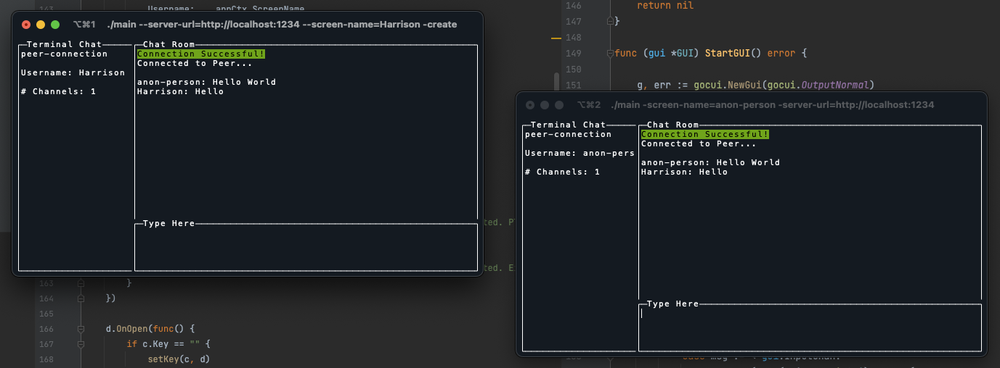

# Terminal Chat

a Peer to peer terminal chat application featuring end to end AES encryption, a GUI, optional gRPC, and other features.



### Installation

`go install github.com/HarrisonWAffel/terminal-chat` ???

### Program flags

```
Usage of ./terminal-chat:
  -create
        pass this flag if you wish to begin a conversation and wait for a peer to connect
  -grpc
        pass this flag to start or connect to a gRPC server
  -room-name string
        The room name to be created or connected to
  -screen-name string
        The name you wish to use in the conversation
  -server
        run the application in server mode. Clients connect to the server to
        exchange pion connection information between hosts before establishing the p2p connection
  -server-port string
        The server port that should be used, should begin with : (e.g. :8080)  (default ":8080")
  -server-url string
        The URL of the server you want to connect to communicate p2p connection info with another client
```

### Architecture
```
                                                    |          Steps
               --------------------                 |  1. Peer One POSTS token
       +------>| Discovery Server | <------+        |     and webRTC info, waits 
       |       --------------------        |        |     
       |                                   |        |  2. DS Stores webRTC   
       |                                   |        |     info using token
       |                                   |        |              
       |                                   |        |  3. Peer Two POSTS webRTC 
       |                                   |        |     info and gives token
       |                                   |        |   
       |                                   |        |  4. DS forwards P2 webRTC
       v                                   v        |     info to P1 and P1 
 ------------                        ------------   |     webRTC info to P2.
 | Peer One | <--------------------> | Peer Two |   | 
 ------------                        ------------   |  5. Clients directly connect 
                                                    |     to one another  
```                        

### Libraries Used 

+ [Pion/webRTC](https://github.com/pion/webrtc) - webRTC communication
+ (optional) [go-gRPC](https://grpc.io/docs/languages/go/) - REST alternative
+ [goCUI](https://github.com/jroimartin/gocui) - GUI API 


### How to Run 

This application needs to connect to a dedicated server so that peers may share their
connection details with one another using custom room-names.


I (at the time of writing) am hosting a free HTTPS terminal-chat server that can be found at this address, 
+ https://terminal-chat.space

To use this URL by default run this command (and omit the `-server-url` flag when running any following commands)

`export TERMINAL_CHAT_URL=https://terminal-chat.space`

#### Connecting Clients

Once a dedicated server has been created peers can begin to connect with one another using the following commands

To create a new connection token use the following command, you can provide a custom token or use a generated UUID as a token by omitting the `-room-name` flag and passing `n`.
```bash 
./terminal-chat -server-url=${SERVER_URL} -screen-name=host -create -room-name=${TOKEN}
```

To connect to a conversation run the following command
```bash 
./terminal-chat -server-url=${SERVER_URL} -screen-name=guest -room-name=${TOKEN}
```

#### Creating A Server

A Dockerfile for the server has been provided.
This server must be exposed to the internet if you wish to have peers from outside of
your local network connect to you. The dedicated server only
holds onto connection details for ten minutes at most, and deletes all connection information once
both parties have connected to one another.

To start the dedicated server, compile this repository and run
one of the following commands,

To run without a docker container
```bash
./terminal-chat -server -server-port=":8081"
```

To run without a docker container as a gRPC server (**Note that clients must also pass the `-grpc` flag when connecting to a grpc server**)
```bash
./terminal-chat -server -server-port=":8081" -grpc
```

To run with a docker container
```bash 
docker build . -t terminal-chat-server && docker run -p 8081:8081 -d terminal-chat-server 
```


### Server Deployment Notes

+ when hosting an HTTP/S server you should set all timeouts (gateway, read, write) to 10 **minutes** to ensure room hosts can receive peer connection information.

+ gRPC servers require an HTTP2 compatible cloud environment, other than this requirement the gRPC implementation is generally better than the HTTP/s implementation.
